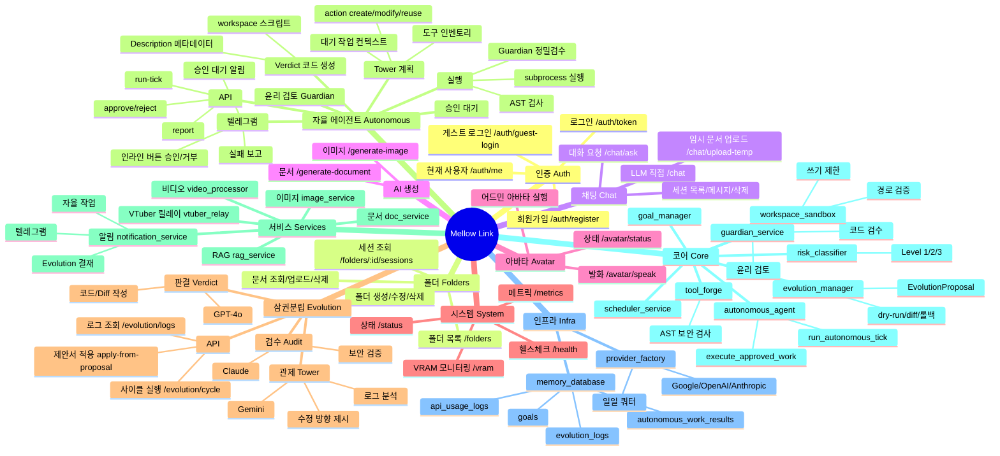

# Mellow Link 에이전트 기능 마인드맵

> 마인드맵 뷰어(Mermaid 지원) 또는 [Mermaid Live Editor](https://mermaid.live)에서 시각화 가능



---

## 텍스트 트리 (간단 요약)

```
Mellow Link
├── 인증 (Auth): 회원가입, 로그인, 게스트, /auth/me
├── 폴더 (Folders): CRUD, 세션, 문서 업로드
├── 채팅 (Chat): /chat/ask, 세션/메시지 관리, 임시 문서
├── AI 생성: 이미지, 문서
├── 아바타: 상태, 발화, 어드민 실행
├── 시스템: health, status, VRAM, metrics
├── 삼권분립 (Evolution) [어드민]
│   ├── Tower(Gemini) → Verdict(GPT-4o) → Audit(Claude)
│   ├── /evolution/cycle, apply-from-proposal, logs
│   └── 결재 보고서, VIP 텔레그램 알림
├── 자율 에이전트 (Autonomous) [어드민]
│   ├── Tower 계획 (대기 작업, 도구 인벤토리, action)
│   ├── 중복 배팅 차단 (80% 유사도)
│   ├── 윤리 검토 → Verdict 코드 → AST/Guardian 검증
│   ├── workspace/ 스크립트 실행, PYTHONPATH
│   ├── /autonomous/run-tick, report, approve, reject
│   └── 텔레그램 인라인 버튼 승인/거부, 실패 보고
├── 웹훅: /webhooks/telegram (인라인 버튼 callback)
├── 서비스: image, doc, RAG, video, vtuber_relay, notification
├── 코어: evolution_manager, guardian, autonomous_agent, risk_classifier, tool_forge, workspace_sandbox
└── 인프라: memory_database, provider_factory, env_loader
```
